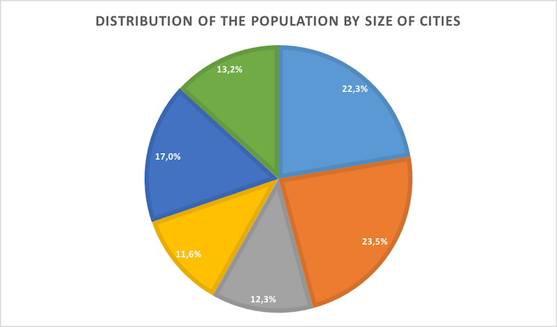

# Sheet 2: Colors

Whether on an image, in a text or in a video, you must pay particular attention to the use that you make of colors.

## Issues for users with disabilities

Colors are an important issue for users who do not perceive the colors at all, especially blind people, those with very low vision or those who have color perception impairments (color blindness for example).

Color is sometimes the only vector used to convey information. For example, in a list, you may have written the required items in red and left the optional items in black. A user who can't see these colors will not have access to this information. You must always provide another means, preferably textual, so that all users, regardless of their ability to perceive, can access this information.

Another problem related to color concerns the contrasts. For a user who has difficulty perceiving contrasts, some writings may be impossible to read if the text color is not sufficiently contrasted with the background color.

## In practice and in pictures

### Color contrasts

Color contrast refers to the contrast ratio between the text color and its background color.

These contrasts concern:

- the text you input through the editor;
- the texts in images;
- the texts embedded in the videos.

There are values ​​that provide a minimum contrast sufficient for a large number of users with color perception difficulties.

To evaluate the contrasts of the elements you insert, you can use tools:

- The [WCAG Contrast Checker extension for Firefox](https://addons.mozilla.org/fr/firefox/addon/wcag-contrast-checker/) allows you to perform a quick check of textual content on your web page. It also has an eye-dropper-style picker, that allows you to pick the colors you want to analyze;
- The [Colour Contrast Analyser](https://www.paciellogroup.com/resources/contrastanalyser/), thanks to an eye-dropper-style picker, allows you to pick colors on all document formats (web, Office documents, videos...) to analyze them;
- [Tanaguru Contrast Finder](https://addons.mozilla.org/fr/firefox/addon/tanaguru-contrast-finder/) allows to quickly check contrast of textual content on a web page, and provides a way to find valid contrasts, if possible, for your original palette.

For support on installing extension in Firefox, you may check: <a href="https://support.mozilla.org/en-US/kb/find-and-install-add-ons-add-features-to-firefox">Find and install add-ons to add features to Firefox</a>.

These applications, in addition to providing you with a quantified evaluation of the contrast, allow to evaluate directly against the standard. At a glance, you can know whether your contrasts are sufficient or not.

Below is an example of a site color evaluation with WCAG Contrast Checker.

### Information conveyed by color

Some images or formatting options can convey information through color. This is often the case with graphics, for example. The color symbolizes an element and this color is defined in a caption.

#### Example of a graph

When it is a graph present in an image, the best solution is to provide a detailed description of this image. We refer you to [sheet 1: When a picture is worth a thousand words](images.md) to understand how to provide a detailed description.

Below is an example of a graph where information conveyed by color is essential to understand it. The best alternative is to write a detailed description of the graph.

Distribution of population by size of cities (detailed description of the graph):

- Cities with less than 1,000 inhabitants represent 22.3% of the population.
- Cities with between 1,000 and 5,000 inhabitants represent 23.5% of the population.
- Cities with between 5,000 and 10,000 inhabitants represent 12.3% of the population.
- Cities with between 10,000 and 20,000 inhabitants represent 11.6% of the population.
- Cities with between 20,000 and 50,000 inhabitants represent 17% of the population.
- Cities with more than 50,000 inhabitants represent 13.2% of the population.

#### Example of an illustration

In images, color can convey information. For example, in the image below, the color highlights the area of ​​the brain described in an associated article. The information conveyed here is the position of the aera in question. This information must be found in the text adjacent to the image. For example, the text may contain: "The nucleus is located at the back of the brain".

It is important that this information is not present only in the image [replacement text](#glossaire.md#replacement-text). Indeed, the replacement text is often only accessible to people who use a [screen reader](glossary.md #screen-reader). People who have color perception issue do not use this kind of software and will not have access to the alternative text. This is why it is important that the description of the information conveyed through color is available in a visible text.

## Memo for action

- I colored several texts in my content. Does this information make sense for my content or is it just decorative?
- On the image I have inserted, several areas are colored. Is this information important? Can I find it in the accompanying text?
- The image I have inserted has text. Is this text sufficiently contrasted with the background color?

## See also&hellip;

- Write detailed descriptions when images contain information conveyed through color. See [file 1: When a picture is worth a thousand words](images.md).

## See elsewhere&hellip;

- [Making Selected Button States Clear for Color Blind Users](http://uxmovement.com/buttons/making-selected-button-states-clear-for-color-blind-users/).

## Matching criteria in the RGAA 3

- [Criterion 3.1 [A]](https://disic.github.io/rgaa_referentiel_en/criteria.html#crit-3-1)
- [Criterion 3.2 [A]](https://disic.github.io/rgaa_referentiel_en/criteria.html#crit-3-2)
- [Criterion 3.3 [AA]](https://disic.github.io/rgaa_referentiel_en/criteria.html#crit-3-3)
- [Criterion 3.4 [AAA]](https://disic.github.io/rgaa_referentiel_en/criteria.html#crit-3-4)

## Summary of the "Accessible Authoring for the Web" guide

* [Introduction](0-intro.md)
* [Sheet 1: When a picture is worth a thousand words](images.md)
* [Sheet 2: Colors](colors.md)
* [Sheet 3: Embed content from other sites on your pages](frames.md)
* [Sheet 4: Multimedia for Everyone](multimedia.md)
* [Sheet 5: Tables to present data, <i>what else?</i>](tables.md)
* [Sheet 6: Creating links without losing one's path](links.md)
* [Sheet 7: Headings, or the page outline](headings.md)
* [Sheet 8: Bulleted lists and numbered lists](lists.md)
* [Sheet 9: Multilingual texts](language.md)
* [Sheet 10: Quotations](quotes.md)
* [Sheet 11: Formatting texts](formatting.md)
* [Sheet 12: Downloadable documents](downloadable_documents.md)
* [Sheet 13: Abbreviations, complex words and glossary](definition.md)
* [Glossary](glossary.md)
