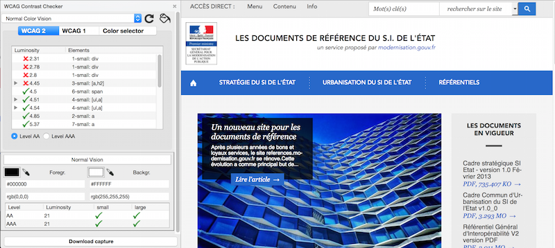

# Fiche 2&nbsp;:Couleurs

Que ce soit sur une image, dans un texte ou encore dans une vidéo, vous devez prêter une attention particulière à l'utilisation que vous faites des couleurs.

## L'enjeu pour l'utilisateur en situation de handicap

Les couleurs sont une problématique importante pour les utilisateurs qui ne perçoivent pas du tout les couleurs, notamment les personnes aveugles, très malvoyantes ou celles qui ont des déficiences de perception des couleurs (daltonisme par exemple).

La couleur est parfois le seul vecteur utilisé pour donner de l'information. Par exemple, dans une liste, vous avez mis en rouge les éléments obligatoires et laissé en noir les éléments optionnels. Un utilisateur qui ne peut pas voir ces couleurs n'aura pas accès à cette information. Vous devez toujours fournir un autre moyen, et de préférence textuel, pour que tous les utilisateurs, quelle que soit leur capacité de perception, puissent avoir accès à cette information.

Une autre problématique liée à la couleur concerne les contrastes. Pour un utilisateur qui a des difficultés à percevoir les contrastes, certaines écritures peuvent être impossibles à lire si la couleur d'écriture n'est pas suffisamment contrastée par rapport à la couleur du fond.

## En pratique et en images

### Les contrastes de couleurs

Les contrastes de couleurs concernent le rapport de contraste entre la couleur d'écriture d'un texte et sa couleur de fond.

Ces contrastes concernent&nbsp;: 

- les textes que vous saisissez dans l'éditeur&nbsp;;
- les textes présents dans les images&nbsp;;
- les textes incrustés dans les vidéos.

Il existe des valeurs qui assurent un contraste minimum suffisant pour une large part des utilisateurs ayant des difficultés de perception des couleurs.

Pour évaluer les contrastes des éléments que vous insérez, vous pouvez vous aider d'outils&nbsp;:

- [l'extension WCAG Contrast Checker pour Firefox](https://addons.mozilla.org/fr/firefox/addon/wcag-contrast-checker/) vous permet de réaliser un contrôle rapide sur votre page web des contenus textuels, elle possède également une pipette qui vous permet de piocher vous-même des couleurs à analyser&nbsp;;
- [le logiciel Colour Contrast Analyser (compatible Windows - source du lien en anglais)](https://www.visionaustralia.org/business-and-professionals/digital-accessibility-services/resources/tools-to-download/colour-contrast-analyser-2-2-for-web-pages), grâce à une pipette, vous permet d'aller piocher des couleurs sur tous les formats de documents (web, bureautique, vidéos ...) pour les analyser&nbsp;;
- [l'extension Tanaguru Contrast Finder](https://addons.mozilla.org/fr/firefox/addon/tanaguru-contrast-finder/) vous permet de réaliser un contrôle rapide sur votre page web des contenus textuels et vous fournit un moyen de trouver des contrastes valides proches, si possible, de vos couleurs originales.

Pour vous aider, vous pouvez consulter <a href="https://support.mozilla.org/fr/kb/trouver-installer-modules-firefox">l'aide sur l'installation d'extension sur Firefox</a>.

Ces logiciels, en plus de vous fournir une évaluation chiffrée du contraste, vous fournissent directement l'évaluation au regard de la norme. D'un coup d'œil, vous pouvez savoir si vos contrastes sont suffisants ou non.

Ci-dessous, un exemple d'évaluation des couleurs d'un site avec WCAG Contrast Checker.

### L'information par la couleur

Certaines images ou mises en forme peuvent véhiculer de l'information grâce à la couleur. C'est souvent le cas des graphiques par exemple. La couleur symbolise un élément et cette couleur est définie dans une légende.

#### Exemple d'un graphique

Lorsqu'il s'agit d'un graphique présent dans une image, la meilleure solution est de réaliser une description détaillée de cette image. Nous vous renvoyons à la [fiche 1&nbsp;: Quand une image vaut mille mots](images.md) pour comprendre comment réaliser une description détaillée.

Ci-dessous un exemple de graphique où l'information par la couleur est indispensable pour le comprendre. La meilleure alternative qui soit est alors de rédiger une description détaillée du graphique.

Répartition de la population par taille de communes (description détaillée du graphique)&nbsp;:

- Les communes de moins de 1 000 habitants représentent 22,3% de la population.
- Les communes qui comptent entre 1 000 et 5 000 habitants représentent 23,5% de la population.
- Les communes qui comptent entre 5 000 et  10 000 habitants représentent 12,3% de la population.
- Les communes qui comptent entre 10 000  et 20 000 habitants représentent 11,6% de la population.
- Les communes qui comptent entre 20 000 et 50 000 habitants représentent 17,0% de la population.
- Les communes de plus de 50 000 habitants représentent 13,2% de la population.

#### Exemple d'une illustration

Sur les images, la couleur peut apporter une information. Par exemple, sur l'image ci-dessous, la couleur met en évidence la zone du cerveau concernée dans un article associé. L'information véhiculée ici est la position de la zone en question. Cette information doit se retrouver dans le texte adjacent à l'image. Par exemple, on pourra retrouver dans le texte&nbsp;: « Le noyau est situé à l'arrière du cerveau ».

Il est important que cette information ne soit pas uniquement présente dans le [texte de remplacement de l'image](#glossaire.md#texte-de-remplacement). En effet, le texte de remplacement n'est bien souvent accessible qu'aux personnes qui utilisent un [lecteur d'écran](glossaire.md#lecteur-decran). Les personnes qui ont des difficultés de perception des couleurs n'utilisent pas ces logiciels et n'auront pas accès au texte de remplacement. C'est pourquoi il est important que la description de l'information donnée par la couleur soit réalisée de manière textuelle et visible.

## Mémo pour agir

- J'ai mis plusieurs textes en couleurs dans mon contenu. Cette information apporte-t-elle un sens à mon contenu ou est-ce simplement décoratif&nbsp;?
- Sur l'image que j'ai insérée, plusieurs zones sont colorées. Cette information est-elle importante&nbsp;? Est-ce que je la retrouve dans le texte qui l'accompagne&nbsp;?
- L'image que j'ai insérée possède du texte. Ce texte est-il suffisamment contrasté par rapport à la couleur de fond&nbsp;?

## Voir aussi...

- Rédiger des descriptions détaillées lorsque les images comportent de l'information donnée par la couleur. Voir la [fiche 1&nbsp;: Quand une image vaut mille mots](images.md).

## Voir ailleurs...

- [Créer des états de boutons accessibles pour les utilisateurs ne percevant pas la couleur (ressources en anglais)](http://uxmovement.com/buttons/making-selected-button-states-clear-for-color-blind-users).

## Correspondances RGAA 3.0

- Critère 3.1 [A]
- Critère 3.2 [A]
- Critère 3.3 [AA]
- Critère 3.4 [AAA]

### Sommaire du guide «&nbsp;Contribuer sur le Web de manière accessible&nbsp;»

* [Introduction](0-intro.md)
* [Fiche 1&nbsp;: Quand une image vaut mille mots](images.md)
* [Fiche 2&nbsp;: Les couleurs](couleurs.md)
* [Fiche 3&nbsp;: Embarquer des contenus d'autres sites sur ses pages](cadres.md)
* [Fiche 4&nbsp;: Du multimédia pour tous et toutes](multimedia.md)
* [Fiche 5&nbsp;: Des tableaux pour présenter des données, <i lang="en">what else?</i>](tableaux.md)
* [Fiche 6&nbsp;: Créer du lien sans perdre son chemin](liens.md)
* [Fiche 7&nbsp;: Les titres, ou le plan de la page](titres.md)
* [Fiche 8&nbsp;: Listes à puces et listes numérotées](listes.md)
* [Fiche 9&nbsp;: Textes multilingues](langue.md)
* [Fiche 10&nbsp;: Citations](citations.md)
* [Fiche 11&nbsp;: Mise en forme des textes](mise-en-forme.md)
* [Fiche 12&nbsp;: Documents en téléchargement](docs_telechargement.md)
* [Fiche 13&nbsp;: Abréviations, mots complexes et glossaire](definition.md)
* [Glossaire](glossaire.md)
