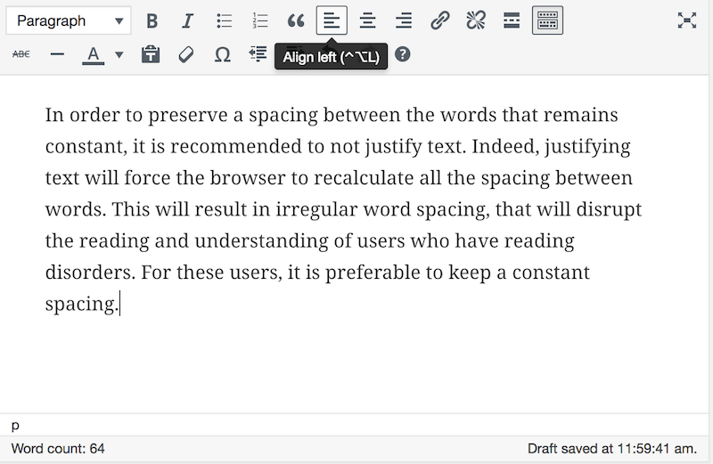

# Sheet 11: Formatting texts

**Since all the recommendations in this sheet are often difficult to implement, they do not fall under the minimum level required by French law. These are AAA-level recommendations that allow access to information to certain users. In spite of this, they remain important and even essential recommendations for access to information for certain users.**

On the web, it is necessary to **separate content and presentation**.

Content is the information you provide as an author. It is mainly constituted of text and images.

The presentation relates to things like the text colors, the characters size and all the other text properties, the positioning of the elements&hellip; The presentation is the responsibility of the designer, who defined a style sheet that applies to the elements of the page.

You mustn't change these properties, especially text properties, with the text editors you use to insert content. Indeed, these styles (color, leading, etc.) have been designed and crafted for accessibility. If you modify them without knowing the impacts, it can result in a lack of accessibility.

## Issues for users with disabilities

The formatting of texts is an issue that mainly affects people with cognitive disorders (like dyslexia for example).

For instance, too narrow leading (line spacing) is an additional difficulty for these users. Likewise, a fancy font might be more difficult to read. Indeed, some users who have reading difficulties (people with dyslexia in particular), need text with specific properties, so as to not be a barrier to understanding. Formatting that does not respect certain standards requires an extra effort for these users to decipher, to the detriment of understanding.

You should also be aware that the following recommendations can be achieved by setting up configuration systems on the users' side. For example, you can provide a button on your site that will remove any text justifications, or a button to increase line spacing. Seek assistance from the developers of your site to learn more about these customization mechanisms.

## In practice and in pictures

### Justified text

In order to preserve a spacing between the words that remains constant, it is recommended to not justify text. Indeed, justifying text will force the browser to recalculate all the spacing between words. This will result in irregular word spacing, that will disrupt the reading and understanding of users who have reading disorders. For these users, it is preferable to keep a constant spacing.

In most rich text editors, you have several buttons that allow you to configure text alignment:

- a button to align the text to the left (and another to the right), usually symbolized by this icon ;
- a button to justify a text, generally symbolized by this icon .

Below is an example of left-aligned text in the WordPress text editor.

Sometimes, the text alignment is defined by the designer, in the general style sheet of the site that you can't edit. Your alignment changes in the text editor will not change the text alignment for the visitors of your page. If necessary, contact the developers of your site to learn about constrained formatting on the site, and possible changes.

### Line spacing

It is preferable to have a sufficiently wide spacing. Line spacing should be  at least 1.5 times the size of the text.

It is very rare to find a text editor that lets you define line spacing. Here again, get closer to the developer of your site for this issue.

## Matching criteria in the RGAA 3

- [Criterion 10.9 [AAA]](https://disic.github.io/rgaa_referentiel_en/criteria.html#crit-10-9)
- [Criterion 10.12 [AAA]](https://disic.github.io/rgaa_referentiel_en/criteria.html#crit-10-12)

## Summary of the "Accessible Authoring for the Web" guide

* [Introduction](0-intro.md)
* [Sheet 1: When a picture is worth a thousand words](images.md)
* [Sheet 2: Colors](colors.md)
* [Sheet 3: Embed content from other sites on your pages](frames.md)
* [Sheet 4: Multimedia for Everyone](multimedia.md)
* [Sheet 5: Tables to present data, <i>what else?</i>](tables.md)
* [Sheet 6: Creating links without losing one's path](links.md)
* [Sheet 7: Headings, or the page outline](headings.md)
* [Sheet 8: Bulleted lists and numbered lists](lists.md)
* [Sheet 9: Multilingual texts](language.md)
* [Sheet 10: Quotations](quotes.md)
* [Sheet 11: Formatting texts](formatting.md)
* [Sheet 12: Downloadable documents](downloadable_documents.md)
* [Sheet 13: Abbreviations, complex words and glossary](definition.md)
* [Glossary](glossary.md)
