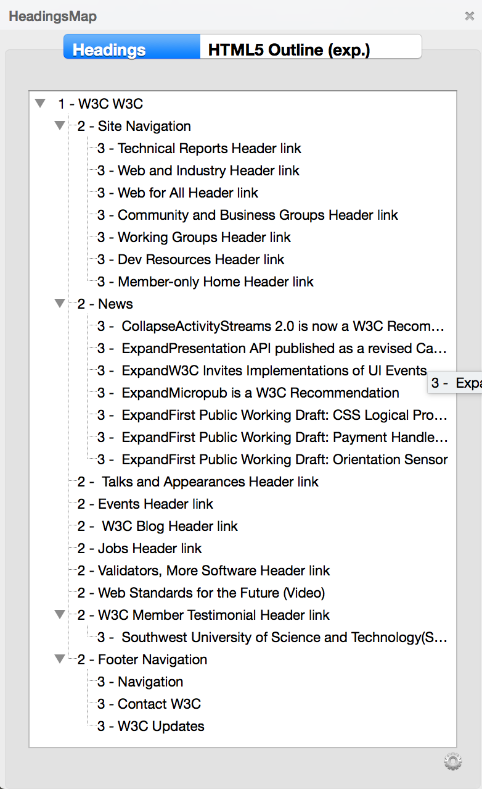
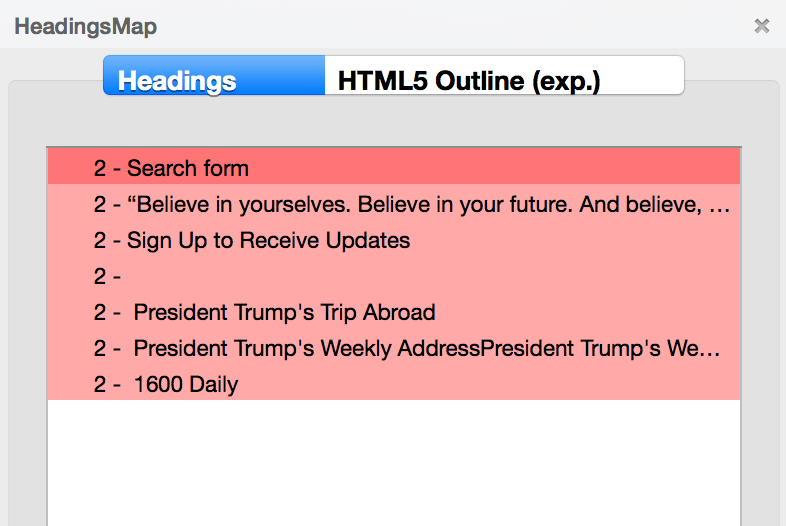

# Sheet 7: Headings, or the page outline

## Issues for users with disabilities

Using headings and sub-headings allows you to structure your text into sections, and provides the user with an outline of the document, giving her the opportunity to skip from heading to heading, navigating faster in the content of the page.

For people with cognitive impairments, the headings make it easier to make sense of the content of the page, and understand its logical articulations more easily.

For users with a motor disability, who rely on the keyboard only, the headings are landmarks that they can use to navigate faster in a page.

For a visually impaired user (blind or partially sighted), web content is a long sequence of text. If she uses a [screen reader](glossary.md#screen-reader), keyboard shortcuts allow her to navigate by element types (headings, form fields, lists, etc.). Without this kind of structure, and since she has no information about text styles (font weight, characters size, etc.), it will be difficult for her to locate herself in the page.

## In practice and in pictures

Any editorial content must have at least one heading that introduces it. Preferably, relatively short titled sections should be created.

Titling is not enough, it is important to respect the hierarchy of headings. If you start your content with a level 1 heading and start a sub-section, the heading of that sub-section must be of level 2, and so on, down to level 6 (lowest available heading level). Note that the number of headings on a page is not limited.

**Warning:** the overall structure of the pages of your site sometimes has one or more headings generated automatically. The heading of the page is often generated automatically with a level 1 heading. Start your content with a level 2 heading, since your content depends on that heading. **Ask the developers of your site from what level of heading you need to start your content.**

In most text editors, you can define headings using a drop-down list that contains all sorts of styles. The headings are designated as "Heading 1", "Heading 2", and so on.

Below is an example of how to define a heading in CKEditor.

To define a heading, you need to:

- Highlight the text you want to transform into a heading;
- Click on "Normal" (sometimes it is a simple drop-down list labelled "Format" or some equivalent);
- Select the desired heading level.

You should not use headings on text elements for layout purposes.

### HeadingsMap: a tool to check the document outline

The <a href="https://addons.mozilla.org/en/firefox/addon/headingsmap/">HeadingsMap</a> Firefox extension allows you to quickly spot outline errors in your content.

For support on installing extension in Firefox, you may check: <a href="https://support.mozilla.org/en-US/kb/find-and-install-add-ons-add-features-to-firefox">Find and install add-ons to add features to Firefox</a>.

Once the extension is installed, go to the page for which you want to check headings, right click in the content window, and select "HeadingsMap". A pane opens on the left side of the page. Select the Headings tab. You get an overview of your hierarchy: the nesting of the different sections and the levels of headings. If an error is detected, it is highlighted in red.

In the example below, the headings structure in the first image is correct. The headings structure in the second image contains several errors. The entire hierarchy is highlighted in red. Indeed, we note that the outline starts with a level 2 heading and that it lacks a heading of level 1 to have a consistent hierarchy.

## Memo for Action

- I styled this text in bold. Should not it be a heading?
- I have a very long text. Would it not be possible to divide it into sub-sections and provide each one with a heading?

## Matching criteria in the RGAA 3

- [Criterion 9.1 [A]](https://disic.github.io/rgaa_referentiel_en/criteria.html#crit-9-1)

## Summary of the "Accessible Authoring for the Web" guide

* [Introduction](0-intro.md)
* [Sheet 1: When a picture is worth a thousand words](images.md)
* [Sheet 2: Colors](colors.md)
* [Sheet 3: Embed content from other sites on your pages](frames.md)
* [Sheet 4: Multimedia for Everyone](multimedia.md)
* [Sheet 5: Tables to present data, <i>what else?</i>](tables.md)
* [Sheet 6: Creating links without losing one's path](links.md)
* [Sheet 7: Headings, or the page outline](headings.md)
* [Sheet 8: Bulleted lists and numbered lists](lists.md)
* [Sheet 9: Multilingual texts](language.md)
* [Sheet 10: Quotations](quotes.md)
* [Sheet 11: Formatting texts](formatting.md)
* [Sheet 12: Downloadable documents](downloadable_documents.md)
* [Sheet 13: Abbreviations, complex words and glossary](definition.md)
* [Glossary](glossary.md)