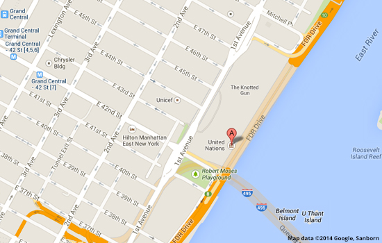

# Sheet 1: When a picture is worth a thousand words&hellip;

There are two types of images:

- Images conveying information (which need a replacement text);
- Decorative images (which must not have replacement text).

## Issues for users with disabilities

Images sometimes carry non-textual information. This information, which can help to understand the content related to the image, must be accessible to all.

Providing an alternative is essential for users who do not perceive, or perceive poorly, the visual content. This is the case for blind or visually impaired people. A [screen reader](glossary.md#screen-reader) will be able to access this alternative and output it for the user.

Similarly, for people who have difficulty understanding certain visual representations (iconography, paintings, multi-dimensional representations, graphs&hellip;), an alternative can help to understand its meaning or to extract the important information.

For all these reasons, it is essential to translate in text the necessary and sufficient information that the images carry.

When these images are links, the essential information to convey is the function of the link, not the contents of the image itself. In this situation, they allow voice-activated software to locate more easily the link to be activated.

## In practice and in pictures

When the information to be conveyed is short, you will use the replacement text.

In your text editor, you must edit the properties of the image to access this replacement text. Generally, adding an image or editing its properties can be accessed by a button representing a small image: 

Below is an example of an image properties window in CKEditor, with a replacement text.

Below is an example of an image properties window in the text editor in WordPress, with a replacement text.

Depending on the text editor at your disposal, the field corresponding to the replacement text of an image can be designated by:

- Alt Text;
- Alternative Text;
- Replacement text.

The replacement text (or alternative text) of an image, is a text attached to the image in the code of the page, you do not see it when you browse the site visually. This information is accessible to a [screen reader](glossary.md#rscreen-reader). Additionally, some users request it to be displayed instead of the image.

You may encounter different cases of representation.

### Images that contain text in image

In these cases, the replacement text is usually the text on the image. On the other hand, if this text is found in the content it accompanies, then this image is a decorative image and must have no alternative. For example, you write an article about an upcoming event with the date and place, and the image shows the poster of the event, where you can read the place and date. In this case, this image does not provide any additional information. Putting it in a replacement text would be redundant.

In the example above, the image (logo) contains the following information:

- The name of the event "The Ocean Conference", which is also the title of the page where it was found (not represented here);
- The location, "United Nations, New York", which can be found in text in the associated article;
- The date, 5 to 9 June 2017, also found in text in the associated article.

### Images that represent a scene or action, a graph, a map, or a diagram

In these cases, if the information is essential to understanding, you must describe it in the replacement text. It is important to remember that images must not be described in detail. You must provide <strong>sufficient and necessary</strong> information.

### Tooltips

In some text editors, you can also set a <strong>tooltip</strong> on images. A tooltip is an information that appears when the image is hovered. It is referred to as tooltips, or title, depending on the text editor. This tooltip must never be a substitute for the replacement text. You may fill the field, but only if the text you enter is <strong>identical</strong> to the replacement text. This tooltip may be useful, for example, in the case of an image of poor quality that contains text and could be a problem for people with visual impairments.

Below is an example of an image properties window in the text editor from WordPress, with a replacement text and a tooltip set.

### Case of complex images: the detailed description

Replacement text is only to be used in the case of images that are easy to describe in a sentence. In the case of a complex image, which requires the writing of an entire paragraph (e.g.  neighborhood map, graphic, histogram), you must provide a detailed description.

When an image requires a detailed description, you will write, under this image, a paragraph. This is the case for complex images such as a data graphic or computer graphics.

To allow a user of [screen reader](glossary.md#screen-reader) to link your image to its detailed description, you will proceed as follows:

- In the field that allows to define a replacement text, provide a title for your image without describing it, indicating that there is a description. For example: "Access map (see description below)";
- At the beginning of your detailed description, you will repeat this title. For example: "Access map (detailed description): To access&hellip;".

It is important to note that <strong>your detailed description must be properly structured</strong>. For example, in the case of a complex graph, a detailed description could describe the information in the form of a table or a list. A detailed description is not necessarily a simple paragraph, it is up to you to choose the most appropriate structuration for the information. See the relevant sheets to find out more.

#### Example of a complex image with a detailed description

Below is an example of a complex image. This is a location map. A replacement text is not sufficient to transcribe all the information available on this map.

##### Detailed description of the access map to the United Nations Headquarters, in New York City

The United Nations Headquarters are located between 1st Avenue and FDR Drive (exit 8), next to the Robert Moses Playground. 

From Grand Central Metro Station, exit 7, take E 42nd street to East River. The UN Headquarters are on left hand, on FDR Drive.

## Memo for Action

- If I delete this image, can I understand the text that is around without losing any information?
- Is the replacement text of this image sufficient, and does it provide the same information as the image?

## Stereotypes

### Stop SEO abuse

It is a barrier to accessibility to use the replacement text or the tooltip of an image, to insert keywords or phrases for search engine optimization (SEO).

Indeed, a [screen reader](glossary.md#screen-reader) user will be given all this information. The reading experience will then be overloaded with parasitic elements and make the contents of the site incomprehensible.

### An image may have an empty alternative

All images do not need a replacement text. If the image is decorative (it does not provide any essential information to the content), it should not have any replacement text. For the same reason mentioned above, it makes it harder to read the content, a [screen reader](glossary.md#screen-reader) user, with no gain in terms of information.

### The alternative of the image must not be used to mention credits (author, date, etc.) of the image

If you are crediting an image, you should not use the image replacement text. First, it means that not everyone has access to this information. Second, the replacement text is used to describe the image, not to provide credits for it. In the specific case of credits, the method described in the section on detailed descriptions is appropriate.

## See also&hellip;

- When an image is also a link, the link function outweighs the nature of the image. See [sheet 6: Creating links without losing one's path](links.md);
- Caution with contrasts and information conveyed through color. See [sheet 2: Colors](colors.md).

## See elsewhere&hellip;

- [Before and After Demonstration](https://www.w3.org/WAI/demos/bad/Overview.html): check for examples of correct and incorrect replacement texts for images

## Matching criteria in the RGAA 3

- [Criterion 1.2 [A]](https://disic.github.io/rgaa_referentiel_en/criteria.html#crit-1-2)
- [Criterion 1.3 [A]](https://disic.github.io/rgaa_referentiel_en/criteria.html#crit-1-3)
- [Criterion 1.6 [A]](https://disic.github.io/rgaa_referentiel_en/criteria.html#crit-1-6)
- [Criterion 1.7 [A]](https://disic.github.io/rgaa_referentiel_en/criteria.html#crit-1-7)
- [Criterion 1.10 [A]](https://disic.github.io/rgaa_referentiel_en/criteria.html#crit-1-10)

## Summary of the "Accessible Authoring for the Web" guide

* [Introduction](0-intro.md)
* [Sheet 1: When a picture is worth a thousand words](images.md)
* [Sheet 2: Colors](colors.md)
* [Sheet 3: Embed content from other sites on your pages](frames.md)
* [Sheet 4: Multimedia for Everyone](multimedia.md)
* [Sheet 5: Tables to present data, <i>what else?</i>](tables.md)
* [Sheet 6: Creating links without losing one's path](links.md)
* [Sheet 7: Headings, or the page outline](headings.md)
* [Sheet 8: Bulleted lists and numbered lists](lists.md)
* [Sheet 9: Multilingual texts](language.md)
* [Sheet 10: Quotations](quotes.md)
* [Sheet 11: Formatting texts](formatting.md)
* [Sheet 12: Downloadable documents](downloadable_documents.md)
* [Sheet 13: Abbreviations, complex words and glossary](definition.md)
* [Glossary](glossary.md)