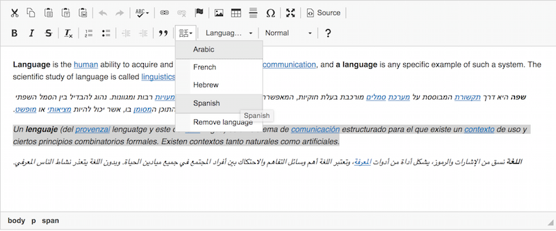
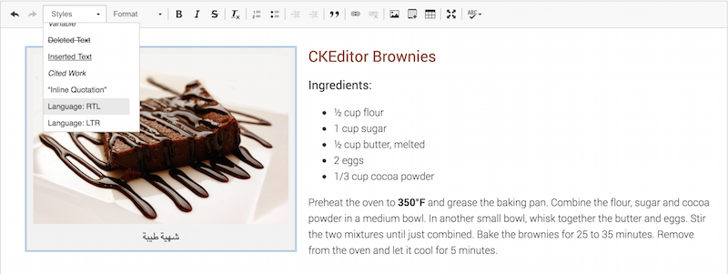

# Sheet 9: Multilingual texts

## Issues for users with disabilities

Users who are blind, visually impaired, or have reading difficulties, and use a [screen reader](glossary.md#screen-reader), will generally get a spoken version of the written content, thanks to their speech synthesizers. They rely on the pronunciation of words for understanding. In the specific case of words in foreign languages, certain words or expressions, require to be pronounced in their original language in order to be understood. If someone said "<i lang="fr">rendez-vous</i>" as if it was an English word, would you understand?

A web page has a main human language (French, English, etc.) that allows a speech synthesizer to speak out the page with the accent and pronunciations that suit this language.

It is possible to require from the screen reader to change the reference language, locally, in the texts, by indicating a change of language.

Exceptions:

- foreign words that have been assimilated (e.g.: burrito). Actually, they have integrated the dictionary of vocal synthesizers, and are therefore pronounced correctly;
- proper nouns.

## In practice and in pictures

### Language Changes

Few text editors allow authors to add a language change without going through the editing of the source code.

Below is an example of a language change in CKEditor. Note that it requires an [optional plugin](http://ckeditor.com/addon/language), compatible with CKEditor version 4.3 and above. Contact the developers of your website, or your IT department, to check if these conditions apply to your CMS.

In this example, to indicate a change of human language you need to:

- Highlight the portion of text on which you want to change the language.
- Click on this button: , with the "Set language" tooltip;
- A menu opens, and you can select one of the languages set in your system. Contact your IT department if you need other languages to be configured.

This kind of feature can be implemented in virtually any open-source CMS or text editor. If, as an author, you insert words in foreign language on a regular basis, and don't want to tweak HTML code, you would largely benefit from it. Again, contact the developers of your website, or your IT department, to discuss this possibility.

### Changing the reading direction

Few text editors allow authors to add a change of reading direction  without going through the editing of the source code.

By default, the reading direction of a web page is from left to right. But if you insert content in a language that is read from right to left, just like changing the language code, you have to specify this.

There are two possible values ​​for the change of reading direction:

- LTR, for "Left To Right";
- RTL, for "Right To Left".

Below is an example of a change of reading direction in the CKEditor text editor.

In the "Styles" menu, in the drop-down list, you can select one of the two possible values ​​for the reading direction.

## Memo for Action

- If I speak aloud this foreign word, without the original pronunciation, is it still understandable?

## Matching criteria in the RGAA 3

- [Criterion 8.7 [AA]](https://disic.github.io/rgaa_referentiel_en/criteria.html#crit-8-7)
- [Criterion 8.8 [AA]](https://disic.github.io/rgaa_referentiel_en/criteria.html#crit-8-8)
- [Criterion 8.10 [AA]](https://disic.github.io/rgaa_referentiel_en/criteria.html#crit-8-10)

## Summary of the "Accessible Authoring for the Web" guide

* [Introduction](0-intro.md)
* [Sheet 1: When a picture is worth a thousand words](images.md)
* [Sheet 2: Colors](colors.md)
* [Sheet 3: Embed content from other sites on your pages](frames.md)
* [Sheet 4: Multimedia for Everyone](multimedia.md)
* [Sheet 5: Tables to present data, <i>what else?</i>](tables.md)
* [Sheet 6: Creating links without losing one's path](links.md)
* [Sheet 7: Headings, or the page outline](headings.md)
* [Sheet 8: Bulleted lists and numbered lists](lists.md)
* [Sheet 9: Multilingual texts](language.md)
* [Sheet 10: Quotations](quotes.md)
* [Sheet 11: Formatting texts](formatting.md)
* [Sheet 12: Downloadable documents](downloadable_documents.md)
* [Sheet 13: Abbreviations, complex words and glossary](definition.md)
* [Glossary](glossary.md)
