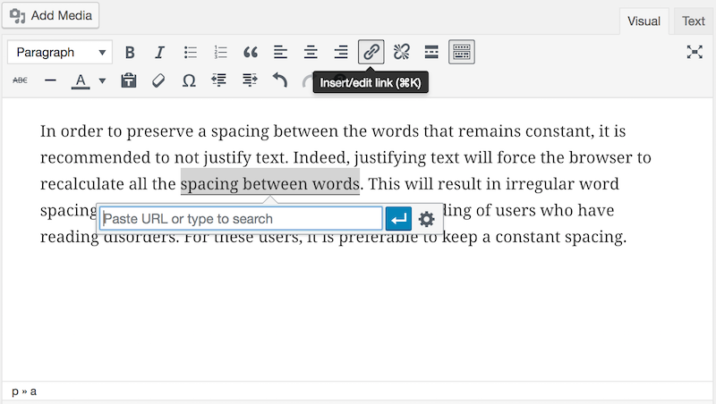
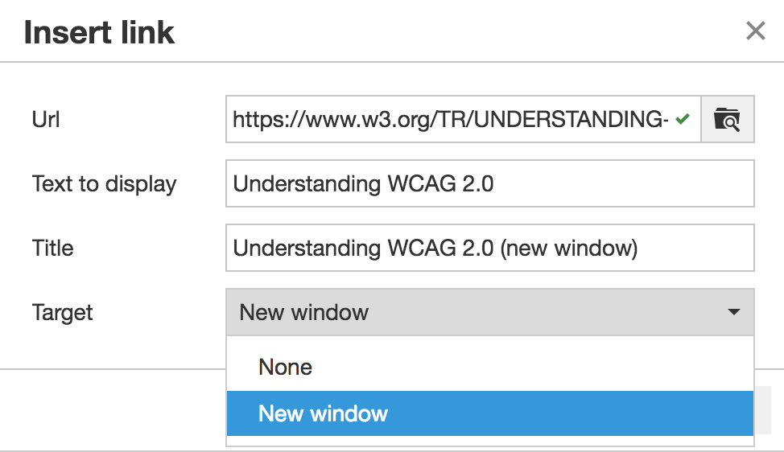

# Fiche 6&nbsp;: Cr&#233;er du lien sans perdre son chemin

Un lien permet de naviguer entre les pages d'un site ou renvoyer vers un autre site. Un lien est défini par deux éléments importants&nbsp;:

- son intitulé, le texte visible cliquable par les utilisateurs&nbsp;;
- son titre (parfois nommé <i lang="en">title</i>)&nbsp;: c'est l'infobulle qui apparaît au survol du lien par la souris.

## L'enjeu pour l'utilisateur en situation de handicap

Pour un utilisateur présentant une déficience visuelle (aveugle ou malvoyant) qui utilise un [lecteur d'écran](glossaire.md#lecteur-decran) et qui n'a pas une vision globale de la page, ou qui navigue entre les liens, il est important de comprendre la fonction d'un lien.

Pour des utilisateurs présentant des déficiences cognitives, des liens peu explicites n'incitent pas à l'action. L'utilisateur ne sait pas, ne comprend pas vers quelle page il se dirige si l'intitulé du lien ne l'explique pas suffisamment.

Lorsque les liens sont constitués par des images seules, c'est le texte alternatif de l'image qui constitue l'intitulé du lien. À ce moment, le texte alternatif à renseigner n'est plus la description de l'image mais la destination du lien. Si l'image n'a pas d'alternative, le lien est alors un lien vide. Un utilisateur qui navigue à la voix ne pourra par exemple par cliquer sur ce lien, ne sachant pas comment les nommer.

## En pratique et en images

Tous les éditeurs permettent d'insérer des liens facilement. Généralement, la fonction qui permet de définir les propriétés d'un lien est représentée par une icône de chaînon&nbsp;: 

Ci-dessous un exemple d'insertion de lien dans l'éditeur de texte de Wordpress.

### Intitulé pertinent

Pour définir l'intitulé de votre lien, sélectionnez la portion de texte nécessaire pour que le lien soit suffisamment explicite.

Dans ce cas précis, on voit un champ «&nbsp;<i lang="en">Title</i>&nbsp;», qui va permettre de définir, si nécessaire, un titre (une infobulle). Si vous décidez de créer une infobulle, vous devez vous assurer&nbsp;:

- que l'intitulé du lien ne peut pas être rendu explicite lui-même&nbsp;;
- que l'infobulle reprend au moins l'intitulé du lien (par exemple ici, l'infobulle doit reprendre au moins «&nbsp;Page d'aide&nbsp;»).

### Ouverture dans une nouvelle fenêtre

Dans certains éditeurs de textes, vous avez la possibilité de demander à ce qu'un lien s'ouvre dans une nouvelle fenêtre lorsque l'utilisateur clique dessus. Si vous choisissez cette option, vous devez systématiquement en informer l'utilisateur. La méthode recommandée est de le faire grâce au titre de lien (infobulle), sur le modèle&nbsp;: «&nbsp;Intitulé du lien - nouvelle fenêtre&nbsp;».

**Note&nbsp;: le développeur de votre site a pu mettre en place une fonctionnalité qui détecte automatiquement les liens qui s'ouvrent dans une nouvelle fenêtre et qui permet de modifier le titre du lien. Renseignez-vous auprès du service informatique sur l'existence de cette fonctionnalité.**

Ci-dessous un exemple d'insertion de lien qui ouvre dans une nouvelle fenêtre dans l'éditeur de texte de TinyMCE.

Dans TinyMCE, il faut éditer les propriétés du lien&nbsp;:
- Dans le champ <i lang="en">Target</i>, choisir <i lang="en">New Window</i> si vous souhaitez que le lien ouvre une nouvelle fenêtre&nbsp;;
- Dans le champ <i lang="en">Text to display</i> s'affiche le texte que vous avez sélectionné pour créer le lien&nbsp;;
- Dans le champ <i lang="en">Title</i> (titre ou infobulle), reprenez l'intitulé du lien et ajoutez la mention «&nbsp;nouvelle fenêtre&nbsp;».

### Apparence des liens

Dans la charte graphique du site a été définie une apparence pour les liens (couleur, soulignement, etc.). Vous ne devez pas modifier cette apparence, même si votre éditeur de texte vous le permet, **au risque de créer une rupture dans l'expérience utilisateur et de créer des problèmes de contraste insuffisant pouvant nuire à la lisibilité.**

En effet, les liens doivent être distingués visuellement du reste du texte environnant selon certaines recommandations. Cette apparence a été définie au moment de la conception du site et le développeur a intégré les recommandations pour tous les liens.

## Mémo pour agir

- Si je regarde le texte de mes liens, est-ce que je comprends où je vais en cliquant dessus&nbsp;?
- Évitez au maximum les intitulés génériques du type&nbsp;: cliquez-ici, ici, lire la suite, visitez cette page, télécharger…
- Deux de mes liens ont des intitulés identiques. Renvoient-ils bien vers la même page&nbsp;?

## Voir aussi…

- Pour les images liens, renseignez un texte de remplacement à l'image pour définir l'intitulé du lien. Voir la [fiche 1&nbsp;: Quand une image vaut mille mots](images.md)
- Pour une explication plus détaillée des contrastes de couleurs, nous vous renvoyons à la [fiche 2&nbsp;: Les couleurs](couleurs.md).

## Voir ailleurs

- [Bonnes pratiques pour l'accessibilité des liens (Sur le site de l'Unité ingénierie des contenus et savoirs)](http://ics.utc.fr/capa/DOCS/SP4/Tuto/02/co/02-CAPA_BonnesPratiques_7.html)

## Correspondances RGAA 3

- Critère 6.1 [A]
- Critère 6.2 [A]
- Critère 6.3 [AAA]
- Critère 6.4 [A]
- Critère 10.6 [A]

### Sommaire du guide «&nbsp;Contribuer sur le Web de manière accessible&nbsp;»

* [Introduction](0-intro.md)
* [Fiche 1&nbsp;: Quand une image vaut mille mots](images.md)
* [Fiche 2&nbsp;: Les couleurs](couleurs.md)
* [Fiche 3&nbsp;: Embarquer des contenus d'autres sites sur ses pages](cadres.md)
* [Fiche 4&nbsp;: Du multimédia pour tous et toutes](multimedia.md)
* [Fiche 5&nbsp;: Des tableaux pour présenter des données, <i lang="en">what else?</i>](tableaux.md)
* [Fiche 6&nbsp;: Créer du lien sans perdre son chemin](liens.md)
* [Fiche 7&nbsp;: Les titres, ou le plan de la page](titres.md)
* [Fiche 8&nbsp;: Listes à puces et listes numérotées](listes.md)
* [Fiche 9&nbsp;: Textes multilingues](langue.md)
* [Fiche 10&nbsp;: Citations](citations.md)
* [Fiche 11&nbsp;: Mise en forme des textes](mise-en-forme.md)
* [Fiche 12&nbsp;: Documents en téléchargement](docs_telechargement.md)
* [Fiche 13&nbsp;: Abréviations, mots complexes et glossaire](definition.md)
* [Glossaire](glossaire.md)
