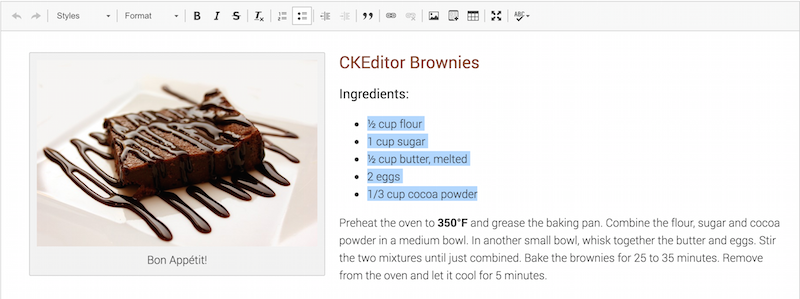

# Fiche 8&nbsp;: Listes &#224; puces et listes num&#233;rot&#233;es

## L'enjeu pour l'utilisateur en situation de handicap

Structurer les contenus avec les éléments appropriés offre une expérience de navigation enrichie pour les utilisateurs de [lecteur d'écran](glossaire.md#lecteur-decran). 

Un utilisateur aveugle, malvoyant ou ayant des difficultés de lecture et qui utilise un [lecteur d'écran](glossaire.md#lecteur-decran) pour parcourir le contenu d'une page, va utiliser des raccourcis claviers pour naviguer entre les types d'éléments. Il peut naviguer de titres en titres, aller au prochain champ de formulaire, ou encore aller à la liste précédente.

En plus de permettre de naviguer entre éléments, cela lui permet également de les éviter.

Dans le cas d'une liste, le nombre d'éléments que contient la liste est annoncé, ainsi que le niveau de l'élément dans la liste. Ainsi, si l'utilisateur juge la liste trop longue, il pourra tout simplement l'éviter plutôt que de la parcourir en entier, il peut aussi aller au début de la liste, ou à la fin directement.  

## En pratique et en images

Pour créer une liste dans un éditeur de texte, vous devez sélectionner les contenus concernés, puis cliquer sur l'icône appropriée.

Dans la plupart des éditeurs de texte riche, il y a deux boutons&nbsp;:

- un bouton permettant de créer une liste non ordonnée, généralement symbolisée par cette icône &nbsp;;
- un bouton permettant de créer une liste ordonnée, généralement symbolisée par cette icône .

Une liste ordonnée est une liste numérotée. Une liste numérotée est requise lorsque l'ordre de succession des éléments est essentielle, par exemple les étapes d'un processus.

Une liste non ordonnée s'applique dans tous les autres cas.

Une liste n'est généralement recommandée que pour des listes d'éléments succincts. Pensez à une liste de courses ou une liste d'étapes d'une recette de cuisine par exemple. 

Ci dessous, un exemple de liste dans l'éditeur CKEditor.

## Mémo pour agir

- Cette succession de très courts paragraphes ne pourrait-elle pas être remplacée par une liste&nbsp;?
- Lorsque vous faites précéder des phrases d'un tiret, ou d'un symbole, demandez-vous si vous n'êtes pas en train de réaliser une «&nbsp;fausse liste&nbsp;».

## Idées reçues

- **La mise en forme de mes listes ne peut pas être modifiée&nbsp;: faux&nbsp;!** Tous les éléments peuvent avoir une mise en forme différente. La structuration n'est pas un frein. Renseignez-vous auprès de la personne en charge de l'intégration graphique pour lui demander des mises en forme différentes pour vos listes.

## Voir aussi...

- Quand le contenu des éléments de listes est important, il est préférable de réaliser des paragraphes titrés. Voir la [fiche 7&nbsp;: Les titres, ou le plan de la page](titres.md)

## Voir ailleurs...

- [Bonnes pratiques pour la structuration des documents (Sur le site de l'Unité ingénierie des contenus et savoirs)](http://ics.utc.fr/capa/DOCS/SP4/Tuto/02/co/02-CAPA_BonnesPratiques_8.html)

## Correspondances RGAA 3.0

- Critère 9.3 [A]

### Sommaire du guide «&nbsp;Contribuer sur le Web de manière accessible&nbsp;»

* [Introduction](0-intro.md)
* [Fiche 1&nbsp;: Quand une image vaut mille mots](images.md)
* [Fiche 2&nbsp;: Les couleurs](couleurs.md)
* [Fiche 3&nbsp;: Embarquer des contenus d'autres sites sur ses pages](cadres.md)
* [Fiche 4&nbsp;: Du multimédia pour tous et toutes](multimedia.md)
* [Fiche 5&nbsp;: Des tableaux pour présenter des données, <i lang="en">what else?</i>](tableaux.md)
* [Fiche 6&nbsp;: Créer du lien sans perdre son chemin](liens.md)
* [Fiche 7&nbsp;: Les titres, ou le plan de la page](titres.md)
* [Fiche 8&nbsp;: Listes à puces et listes numérotées](listes.md)
* [Fiche 9&nbsp;: Textes multilingues](langue.md)
* [Fiche 10&nbsp;: Citations](citations.md)
* [Fiche 11&nbsp;: Mise en forme des textes](mise-en-forme.md)
* [Fiche 12&nbsp;: Documents en téléchargement](docs_telechargement.md)
* [Fiche 13&nbsp;: Abréviations, mots complexes et glossaire](definition.md)
* [Glossaire](glossaire.md)
