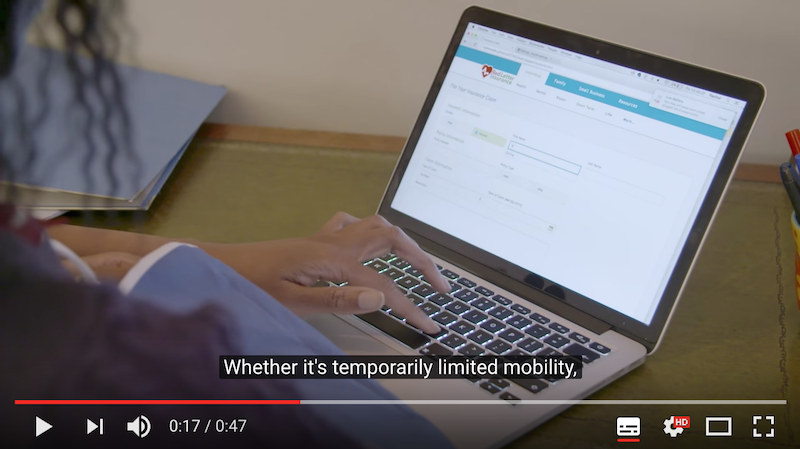
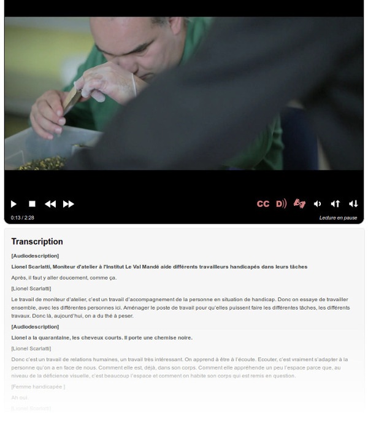

# Fiche 4&nbsp;: Du multimédia pour tous et toutes

La majeure partie des contenus multimédias que vous rencontrerez sont des vidéos (avec ou sans bande son) ou des fichiers sons.

Entrent également dans la catégorie de contenus multimédias, les éléments interactifs comme les animations ou publicités en Flash par exemple.

## L'enjeu pour l'utilisateur handicapé

Les contenus multimédias peuvent véhiculer de l'information par les images (actions, textes incrustés) ou par le son (bande sonore d'une vidéo, ou fichier son seul).

Souvent des textes sont incrustés dans les vidéos, pour présenter un orateur, donner une date... et ne sont pas repris dans le  discours. Les utilisateurs qui ont une déficience visuelle (aveugles ou malvoyants) qui ne peuvent pas appréhender les images, ou celles qui ont des difficultés à comprendre l'information visuelle présente à l'écran pour des raisons cognitives, auront besoin que ces informations visuelles leur soit décrites. Il faut pouvoir, par un autre moyen que l'image, restituer l'information à l'utilisateur.

Les utilisateurs qui présentent une déficience auditive, sourds et malentendants, ne pouvant pas ou difficilement percevoir le contenu audio des documents multimédia, auront besoin d'une traduction en langue des signes ou de sous-titres pour comprendre le contenu audio du contenu multimédia. 

## En pratique et en images

### Donner un titre 

Lorsque vous insérez du contenu multimédia, vous devez le faire précéder d'un titre. Ce titre peut reprendre celui de l'élément lui-même s'il en possède un. Il doit permettre de comprendre quelle est l'information présentée dans ce contenu. Tout élément multimédia doit être considéré comme un contenu à part entière, et donc structuré par un titre. Nous vous renvoyons à la fiche [Les titres, ou le plan de la page](titres.md) pour la mise en place de ce titre.

### Permettre la compréhension des contenus multimédias sans le son

#### Sous-titres

Il ne faut pas confondre le sous-titrage pour la traduction (<i lang="en">subtitles</i>) et le sous-titrage pour sourds et malentendants (<i lang="en">close captions</i>). Ces deux types de sous-titrage poursuivent des buts différents. Dans le cadre du RGAA 3.0, les sous-titres doivent être dans la langue du média concerné. Si la vidéo est en anglais par exemple, les sous-titres doivent être en anglais.

Les sous-titres ne concernent que les vidéos. Ils doivent reprendre toutes les informations de la vidéo&nbsp;: les dialogues de personnages, la voix-off ou même un bruit qui donne un sens et qui permet de comprendre une action. 

Ils doivent êtres correctement synchronisés et ils doivent être activables et désactivables depuis le lecteur. Si le lecteur ne propose pas cette fonctionnalité, alors il est possible de mettre 2 vidéos à disposition&nbsp;: une vidéo sans les sous-titres et une vidéo avec les sous-titres. Chacune peut être placée sur une page différente, l'important est que l'utilisateur comprenne aisément qu'il existe une version avec les sous-titres. Le plus simple sera alors de créer un lien avant la vidéo sans les sous-titres qui mène vers la vidéo avec les sous-titres et au-dessus de la vidéo avec les sous-titres, créer un lien qui ramène vers la vidéo sans les sous-titres.

Ci dessous, un exemple de vidéo avec des sous-titres. [Retrouvez cet exemple sur le site de la délégation à l’accessibilité et aux voyageurs handicapés de SNCF](http://www.accessibilite.sncf.com/actualites/a-la-une/article/video-sncf-24-24-sur-acces-plus).

#### Transcription textuelle

La transcription textuelle concerne les vidéos et les fichiers audios seuls.

Une transcription textuelle est la retranscription en texte de tous les contenus audibles et informatifs de la vidéo. Elle reprend&nbsp;: 

- la totalité de ce qui y est exprimé oralement ;
- toutes les informations descriptives nécessaires à une compréhension équivalente de l'action.

Ces informations textuelles doivent être présentées dans l'ordre chronologique de leur apparition dans la vidéo.

Une transcription textuelle est un contenu texte structuré, comme tout autre contenu texte. Selon les besoins, n'hésitez pas à utiliser les listes, les titres, etc.

La mise à disposition pour les utilisateurs de cette transcription textuelle peut se faire de plusieurs manières&nbsp;:

- elle peut être située juste en dessous de la vidéo elle-même, en précisant de quoi il s'agit. Le mieux étant de titrer également cette vidéo&nbsp;;
- elle peut également être située dans une autre page que celle de la vidéo. Il suffit alors de placer un lien sous la vidéo qui mène vers cette page.

Ci-dessous, un exemple de transcription textuelle située directement sous la vidéo ([Retrouvez cet exemple sur le site du FIPHFP](http://www.fiphfp.fr/Temoignages/Temoignages-d-agents/Lionel-Scarlatti)).

#### Audiodescription

L'audiodescription ne concerne que les vidéos. 

Une audiodescription est une narration ajoutée à la piste sonore de la vidéo pour décrire les détails visuels importants qui ne peuvent être compris à partir de la piste sonore principale seulement.

L'audiodescription d'une vidéo fournit de l'information à propos des actions, des personnages, des changements de scènes, du texte apparaissant à l'écran et d'autres contenus visuels.

Lorsque toute l'information de la vidéo est déjà donnée dans la piste audio, aucune audiodescription supplémentaire n'est requise. Par exemple, dans le cadre d'une interview, il est facile d'éviter le besoin d'audiodescription en annonçant le nom et la fonction des interlocuteurs, qui sont souvent repris en cartouche visuellement. Si ce besoin de description sonore est anticipé, l'audiodescription peut devenir superflue. Prendre en compte ce besoin en conception est moins coûteux, alors pensez-y !

L'audiodescription doit être synchronisée avec la vidéo, et comme les sous-titres, elle doit pouvoir être activée et désactivée.

#### Volume des dialogues

Dans le cas de fichiers sons seuls, vous devez veiller à ce que les dialogues soient suffisamment audibles. Plusieurs solutions sont possibles si ce n'est pas le cas&nbsp;:

- votre lecteur permet de désactiver l'arrière-plan sonore&nbsp;;
- il existe une version alternative sans l'arrière-plan sonore ou avec un volume des dialogues plus élevés.

#### Pas de lancement automatique

Vous devez éviter au maximum de lancer les contenus multimédias qui comportent du son automatiquement au chargement de la page. Ces paramètres existent souvent pour les vidéos que l'on intègre, et même s'il est possible de désactiver le son, il est préférable de ne pas rendre la lecture automatique.

### Contenus multimédia (hors vidéos et fichiers sons)

En dehors des vidéos et fichiers sons, on parle de contenu multimédia non temporel. Il s'agit d'animation ou d'activité interactive réalisée à l'aide d'une technologie qui nécessite une extension. La plus emblématique est la technologie Flash. 

[Voir un exemple d'activité interactive en Flash sur le site du Centre collégial de développement de matériel didactique](http://www.ccdmd.qc.ca/fr/exercices_interactifs/index.cgi?id=1028&action=animer)

Pour ce type de contenu, vous devez vous assurer qu'un utilisateur qui ne peut pas utiliser de souris et qui navigue uniquement à l'aide du clavier puisse réaliser les mêmes actions.

S'il n'est pas possible de rendre cet objet accessible, vous devez fournir une alternative accessible. Dans ce genre de cas, la solution peut être très technique, il est préférable de vous rapprocher du service informatique.

### Accessibilité des interfaces des contenus multimédia

Bien que vous ne soyez pas en capacité d'évaluer complètement l'accessibilité des lecteurs audio ou vidéo ou d'autres objets multimédia, vous pouvez au moins réaliser deux opérations de contrôle.

#### Présence des contrôles minimums

Un lecteur audio ou vidéo doit posséder au minimum 5 contrôles&nbsp;: 

- un bouton de  lecture et de pause&nbsp;;
- un bouton d'arrêt&nbsp;;
- un élément de contrôle du son, qui permet de couper et relancer le son&nbsp;;
- un bouton d'activation et de désactivation des sous-titres (si présents)&nbsp;;
- un bouton d'activation et de désactivation de l'audiodescription (si présente).

#### Utilisation au clavier et à la souris

Tout objet multimédia (qu'il comporte ou non de la vidéo et du son) doit être utilisable au clavier et à la souris. Vous pouvez tester son accessibilité au clavier en utilisant la touche tabulation de votre clavier. De cette manière, assurez-vous que vous accédez à toutes les fonctionnalités de l'objet. Si c'est une vidéo par exemple, assurez-vous que les boutons de lecture, de pause, etc. sont accessibles uniquement en utilisant la touche tabulation et qu'ils sont activables.

## Mémo pour agir

- Peut-on comprendre cette vidéo sans le son&nbsp;?
- Peut-on comprendre cette vidéo sans la voir (juste en l'écoutant)&nbsp;?
- Est-ce que mon fichier son ou ma vidéo possède une transcription textuelle ?
- Puis-je arrêter et relancer la vidéo simplement en utilisant la touche tabulation ?

## Idées reçues

### Pensez à la langue des signes (LSF)
Les sous-titres ne sont pas forcément une alternative suffisante pour les personnes malentendantes. En effet, certaines personnes sourdes ou malentendantes ne lisent et ne comprennent que la langue des signes. C'est pourquoi une transcription textuelle n'est pas forcément une alternative suffisante.

## Voir aussi...

- Donner un titre à vos contenus multimédias. Voir la [fiche 7&nbsp;: Les titres, ou le plan de la page](titres.md)
- Créer des liens pertinents pour renvoyer vers les alternatives des fichiers multimédias. Voir la [fiche 6&nbsp;: Créer du lien sans perdre son chemin](liens.md)

## Voir ailleurs...

- [Des exemples de vidéos accessibles sur le site du FIPHFP](http://www.fiphfp.fr/Temoignages/Temoignages-d-agents)
- [Bonnes pratiques pour l'accessibilité des vidéos (Sur le site de l'Unité ingénierie des contenus et savoirs)](http://ics.utc.fr/capa/DOCS/SP4/Tuto/02/co/02-CAPA_BonnesPratiques_6.html)
- [Bonnes pratiques pour l'accessibilité des fichiers sons (Sur le site de l'Unité ingénierie des contenus et savoirs)](http://ics.utc.fr/capa/DOCS/SP4/Tuto/02/co/02-CAPA_BonnesPratiques_11.html)

## Correspondances RGAA 3.0

- Critère 4.1 [A]
- Critère 4.2 [A]
- Critère 4.3 [A]
- Critère 4.4 [A]
- Critère 4.5 [AA]
- Critère 4.6 [AA]
- Critère 4.7 [AA]
- Critère 4.8 [AA]
- Critère 4.9 [AAA]
- Critère 4.10 [AAA]
- Critère 4.11 [AAA]
- Critère 4.12 [AAA]
- Critère 4.13 [AAA]
- Critère 4.14 [AAA]
- Critère 4.16 [A]
- Critère 4.17 [A]
- Critère 4.18 [A]
- Critère 4.19 [AAA]

### Note concernant les niveaux de conformité
Selon le niveau de conformité au RGAA 3.0, les recommandations en termes d'accessibilité ne sont pas les mêmes pour les éléments multimédias de type vidéo ou audio. Ci-dessous nous résumons brièvement les exigences concernant cette problématique. Ce résumé ne remplace pas les recommandations énoncées dans le référentiel, auquel nous vous renvoyons pour plus de détails&nbsp;: [critères de la thématique multimédia du RGAA 3.0](http://references.modernisation.gouv.fr/referentiel-technique-0#title-124-multimdia).

- Niveau A&nbsp;: 
    - une transcription textuelle ou une audiodescription&nbsp;;
    - des sous-titres synchronisés.
- Niveau AA&nbsp;:
    - une transcription textuelle&nbsp;;
    - des sous-titres synchronisés&nbsp;;
    - une audiodescription synchronisée.
- Niveau AAA&nbsp;:
    - une transcription textuelle&nbsp;;
    - des sous-titres synchronisés&nbsp;;
    - une audiodescription&nbsp;;
    - une audiodescription étendue synchronisée&nbsp;;
    - une interprétation en langue des signes.
    
### Sommaire du guide «&nbsp;Contribuer sur le Web de manière accessible&nbsp;»

* [Introduction](0-intro.md)
* [Fiche 1&nbsp;: Quand une image vaut mille mots](images.md)
* [Fiche 2&nbsp;: Les couleurs](couleurs.md)
* [Fiche 3&nbsp;: Embarquer des contenus d'autres sites sur ses pages](cadres.md)
* [Fiche 4&nbsp;: Du multimédia pour tous et toutes](multimedia.md)
* [Fiche 5&nbsp;: Des tableaux pour présenter des données, <i lang="en">what else?</i>](tableaux.md)
* [Fiche 6&nbsp;: Créer du lien sans perdre son chemin](liens.md)
* [Fiche 7&nbsp;: Les titres, ou le plan de la page](titres.md)
* [Fiche 8&nbsp;: Listes à puces et listes numérotées](listes.md)
* [Fiche 9&nbsp;: Textes multilingues](langue.md)
* [Fiche 10&nbsp;: Citations](citations.md)
* [Fiche 11&nbsp;: Mise en forme des textes](mise-en-forme.md)
* [Fiche 12&nbsp;: Documents en téléchargement](docs_telechargement.md)
* [Fiche 13&nbsp;: Abréviations, mots complexes et glossaire](definition.md)
* [Glossaire](glossaire.md)
