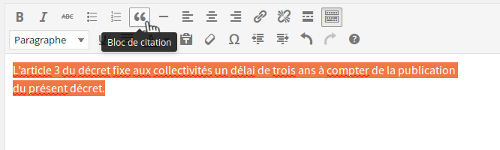

# Sheet 10: Quotations

## Issues for users with disabilities

When you insert a quotation in a text, you usually use quotation marks (or quotes). Quotation marks are typographical signs that can mark a quotation as well as an emphasis.

Marking a quotation correctly allows users who are blind, visually impaired, or have reading difficulties, and who use a [screen reader](glossary.md#screen-reader), to understand that it is indeed a quotation. It also makes it easier to find precisely the beginning and the end of the quotation, without having to search among all the characters the opening and closing quotes.

## In practice and in pictures

There are two types of quotations:

- short quotations, also called inline quotes;
- long quotations, also called blocks quotes.

Few text editors allow you to create inline quotes. On the other hand, most of them allow you to create block quotes, the associated functionality being often represented by an icon with quotation marks like this: .

Below is an illustration of the Inline and Block Quotes features in CKEditor.

- For inline quotes:

    - Highlight the text;
    - Click on "Styles";
    - Scroll down the list to find "Inline Quotation" (inline quote).

- For block quotes:
    - Highlight the text;
    - Select the quotation mark icon (the "Block quote" tooltip appears when hovering with the mouse).

Below is an illustration of the Block Quote feature in TinyMCE.

Below is an illustration of the Block Quote feature in WordPress.

## Memo for Action

- I inserted quotation marks around this text, wouldn't it be a quotation?

### Matching criteria in the RGAA 3

- [Criterion 9.6 [A]](https://disic.github.io/rgaa_referentiel_en/criteria.html#crit-9-6)

## Summary of the "Accessible Authoring for the Web" guide

* [Introduction](0-intro.md)
* [Sheet 1: When a picture is worth a thousand words](images.md)
* [Sheet 2: Colors](colors.md)
* [Sheet 3: Embed content from other sites on your pages](frames.md)
* [Sheet 4: Multimedia for Everyone](multimedia.md)
* [Sheet 5: Tables to present data, <i>what else?</i>](tables.md)
* [Sheet 6: Creating links without losing one's path](links.md)
* [Sheet 7: Headings, or the page outline](headings.md)
* [Sheet 8: Bulleted lists and numbered lists](lists.md)
* [Sheet 9: Multilingual texts](language.md)
* [Sheet 10: Quotations](quotes.md)
* [Sheet 11: Formatting texts](formatting.md)
* [Sheet 12: Downloadable documents](downloadable_documents.md)
* [Sheet 13: Abbreviations, complex words and glossary](definition.md)
* [Glossary](glossary.md)