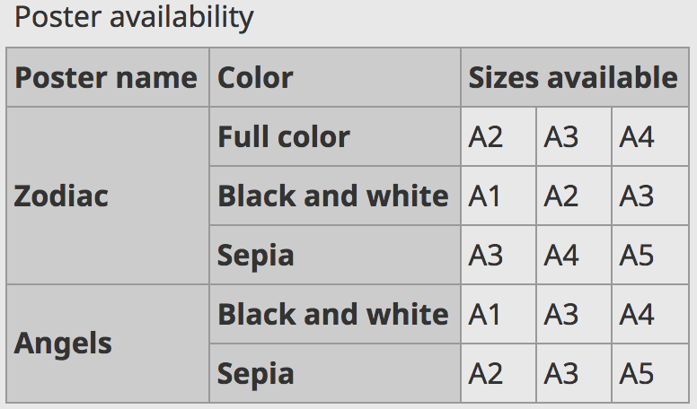

# Sheet 5: Tables to present data, <i>what else?</i>

Generally:

- you should never use tables, except to present tabular data;
- if you have tabular data to present, avoid as much as possible to use tables, because even when they are technically accessible, they remain complex to comprehend.

## Issues for users with disabilities

A table is a particular structure. A blind or low-vision user, who uses a [screen reader](glossary.md#screen-reader), navigates differently in this kind of content, compared to other textual content. If this table is complex (for example, some headers do not apply to all cells in the same row or column), it is all the more difficult to navigate through it, and to understand its meaning in particular.

To help the user read the table, it is important to define headers for columns or rows. When they are defined, the [screen reader](glossary.md#screen-reader) user, who does not have a global view of the table, can access to these headers each time they read any given cell in the table. Users can orient themselves more quickly, without having to browse again in the entire table to know which headers define the data being read.

A table caption is also essential. It informs the user about the content (data type, table structure), which allows her to know whether or not to browse this table, and prepare for reading.

For a cognitively impaired user, presenting the table with a caption also provides keys to understanding the content.

## In practice and in pictures

Most text editors provide a function that allows you to insert a table, often symbolized by an array icon .

Below is an example of a table's properties window in CKEditor.

The tool here proposes to define headers. You can choose whether the headers of your table are for rows or columns (or both).

Then, you must define a table caption. There is usually a "Table Caption" field to fill in. If your tool does not allow you to perform this action, at least, use a [heading](headings.md).

If you are creating a simple data table, the table caption must allow the user to understand the data in question. For example: "Turnover by business line".

Below is an example of a simple table. It has a caption: "concerts" and 3 column headers: Date, Event, Venue.

### Complex data table

If you create a complex table, you must provide a summary of the table in addition to a caption, as to provide keys to navigate in it. This summary can either be placed in the table caption directly, or in a text just before the table.

The summary of a complex table should explain the structure of the table and the data.

A complex data table usually requires adjustments in the table code. You may not have the ability (usually limited by the functions of the text editor) to make the necessary adjustments.

As far as possible, if your table is complex, try to simplify it, even if it means that you create several simple tables.

Below is an example of a complex table. There you will find merged column headers ("Size available") as well as headers that relates to only parts of the table (headers in the second column).

In this case of a complex table, to facilitate reading, it would be preferable, for example, to split this table into two separate tables, each corresponding to a poster name (Zodiac, or Angels).

If this table remains as it is, a relevant summary could be:

"Poster availability. There are 2 types of poster, presented in the first column:

- Zodiac
- Angels

For each poster:

- The second column presents the available colors for each poster;
- The third, forth, and fifth columns present the available size for each color.

## Memo for Action

- Do I really need to create a table?
- Does my table have a caption?
- Are my data understandable? Are the headers correctly defined?

## See also&hellip;

If your tool does not allow you to insert table captions, insert a heading. See [sheet 7: Headings, or the page outline](headings.md)

## See elsewhere&hellip;

- [Video on accessibility of tables (in French, English subtitles available)](http://portail.unice.fr/access-key/videos/les-tableaux).

## Matching criteria in the RGAA 3

- [Criterion 5.1 [A]](https://disic.github.io/rgaa_referentiel_en/criteria.html#crit-5-1)
- [Criterion 5.2 [A]](https://disic.github.io/rgaa_referentiel_en/criteria.html#crit-5-2)
- [Criterion 5.4 [A]](https://disic.github.io/rgaa_referentiel_en/criteria.html#crit-5-4)
- [Criterion 5.5 [A]](https://disic.github.io/rgaa_referentiel_en/criteria.html#crit-5-5)

## Summary of the "Accessible Authoring for the Web" guide

* [Introduction](0-intro.md)
* [Sheet 1: When a picture is worth a thousand words](images.md)
* [Sheet 2: Colors](colors.md)
* [Sheet 3: Embed content from other sites on your pages](frames.md)
* [Sheet 4: Multimedia for Everyone](multimedia.md)
* [Sheet 5: Tables to present data, <i>what else?</i>](tables.md)
* [Sheet 6: Creating links without losing one's path](links.md)
* [Sheet 7: Headings, or the page outline](headings.md)
* [Sheet 8: Bulleted lists and numbered lists](lists.md)
* [Sheet 9: Multilingual texts](language.md)
* [Sheet 10: Quotations](quotes.md)
* [Sheet 11: Formatting texts](formatting.md)
* [Sheet 12: Downloadable documents](downloadable_documents.md)
* [Sheet 13: Abbreviations, complex words and glossary](definition.md)
* [Glossary](glossary.md)