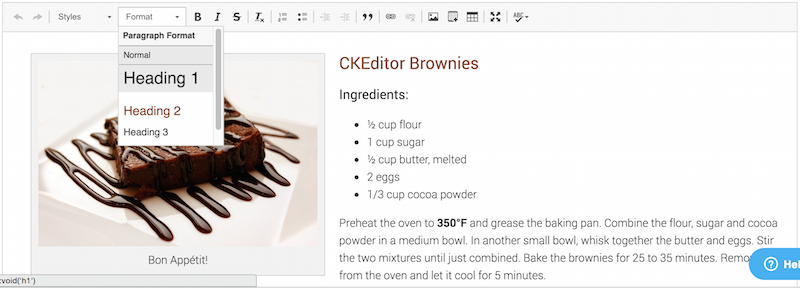
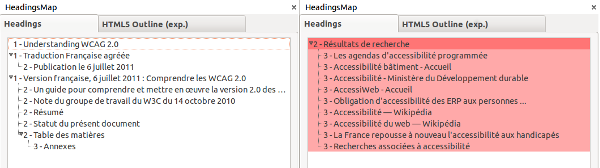

# Fiche 7&nbsp;: Les titres, ou le plan de la page

## L'enjeu pour l'utilisateur handicapé

Utiliser des titres et des sous-titres permet de structurer votre texte en parties et fournit à l'utilisateur un plan du document et lui permet de naviguer de titre en titre pour se déplacer plus rapidement dans le contenu de la page.

Pour des personnes ayant des déficiences cognitives, les titres permettent de mieux appréhender le contenu de la page et d'en saisir plus aisément l'articulation logique.

Pour les utilisateurs ayant un handicap moteur et ne naviguant qu'au clavier, les titres sont autant de jalons qu'ils peuvent utiliser pour naviguer plus rapidement dans une page.

Pour un utilisateur déficient visuel (aveugle ou malvoyant), un contenu web est une longue suite de texte. S'il utilise un [lecteur d'écran](glossaire.md#lecteur-decran), il dispose de raccourcis claviers pour naviguer entre les types d'éléments (titre, champ de formulaire, liste, etc.). Sans structure et sans la possibilité d'appréhender la mise en forme (le gras, la taille des caractères), il lui est difficile de se repérer.

## En pratique et en images

Tout contenu éditorial doit posséder au moins un titre qui l'introduit. De préférence, il faut créer des sections relativement courtes et titrées.

Titrer ne suffit pas, il est important de respecter la hiérarchie des titres. Si vous démarrez votre contenu par un titre de niveau 1 et que vous créez une sous-partie, le titre de cette sous-partie devra être de niveau 2 et ainsi de suite jusqu'au niveau 6 (dernier niveau de titre disponible). À noter que le nombre de titres dans une page n'est pas limité.

**Attention :** la structure globale des pages de votre site a parfois un ou des titres générés automatiquement. Il est fréquent que le titre de la page soit généré automatiquement avec un titre de niveau 1. Démarrer alors votre contenu avec un titre de niveau 2, puisque votre contenu dépend de ce titre principal. **Demandez au développeur de votre site à partir de quel niveau de titre vous devez démarrer vos contenus.**

Dans la plupart des éditeurs de texte, vous pouvez définir des titres à l'aide d'une liste déroulante qui contient toutes sortes de styles. Les titres sont désignés par «&nbsp;Titre 1&nbsp;», «&nbsp;Titre 2&nbsp;» ou parfois en anglais «&nbsp;<i lang="en">Heading 1</i>&nbsp;»...

Ci-dessous un exemple de définition d'un titre dans l'éditeur de texte CKEditor.

Pour définir un titre, vous devez&nbsp;: 

- Surligner le texte que vous souhaitez transformer en titre.
- Cliquer sur « Normal » (parfois c'est une simple liste déroulante qui est à disposition). 
- Choisir le niveau de titre voulu.

Vous ne devez pas utiliser des titres sur des éléments textes qui n'en sont pas pour une question de mise en forme.

### <i lang="en">HeadingsMap</i> : un outil pour vérifier le plan du document

L'extension Firefox, <a href="https://addons.mozilla.org/fr/firefox/addon/headingsmap/">HeadingsMap</a>, vous permet d'un coup d'oeil de repérer les erreurs de titrage dans votre contenu. Pour vous aider, vous pouvez consulter l'<a href="https://support.mozilla.org/fr/kb/trouver-installer-modules-firefox">aide sur l'installation d'extension sur Firefox</a>.

Une fois l'extension installée, placez-vous sur la page dont vous souhaitez tester les titres, faites clic droit et sélectionnez HeadingsMap. Un volet s'ouvre sur la gauche de la page. Placez-vous sur l'onglet <i lang="en">Headings</i>. Vous avez alors une vision rapide de votre hiérarchie : l'imbrication des différentes parties et les niveaux de titres. Si une erreur est détectée, elle est surlignée en rouge. 

Dans l'exemple ci-dessous, la structure de gauche est correcte. La structure de droite quant à elle contient plusieurs erreurs. Toute la hiérarchie est surlignée en rouge. En effet, on constate que le plan démarre avec un titre de niveau 2 et qu'il manque un titre de niveau 1 pour avoir une hiérarchie cohérente.

## Mémo pour agir

- J'ai mis ce texte en gras. Est-ce que ça ne devrait pas plutôt être un titre ?
- J'ai un texte très long. Ne serait-il pas possible de le diviser en sous-parties et leur donner à chacune un titre ?

## Correspondances RGAA 3.0

- Critère 9.1 [A]

### Sommaire du guide «&nbsp;Contribuer sur le Web de manière accessible&nbsp;»

* [Introduction](0-intro.md)
* [Fiche 1&nbsp;: Quand une image vaut mille mots](images.md)
* [Fiche 2&nbsp;: Les couleurs](couleurs.md)
* [Fiche 3&nbsp;: Embarquer des contenus d'autres sites sur ses pages](cadres.md)
* [Fiche 4&nbsp;: Du multimédia pour tous et toutes](multimedia.md)
* [Fiche 5&nbsp;: Des tableaux pour présenter des données, <i lang="en">what else?</i>](tableaux.md)
* [Fiche 6&nbsp;: Créer du lien sans perdre son chemin](liens.md)
* [Fiche 7&nbsp;: Les titres, ou le plan de la page](titres.md)
* [Fiche 8&nbsp;: Listes à puces et listes numérotées](listes.md)
* [Fiche 9&nbsp;: Textes multilingues](langue.md)
* [Fiche 10&nbsp;: Citations](citations.md)
* [Fiche 11&nbsp;: Mise en forme des textes](mise-en-forme.md)
* [Fiche 12&nbsp;: Documents en téléchargement](docs_telechargement.md)
* [Fiche 13&nbsp;: Abréviations, mots complexes et glossaire](definition.md)
* [Glossaire](glossaire.md)
